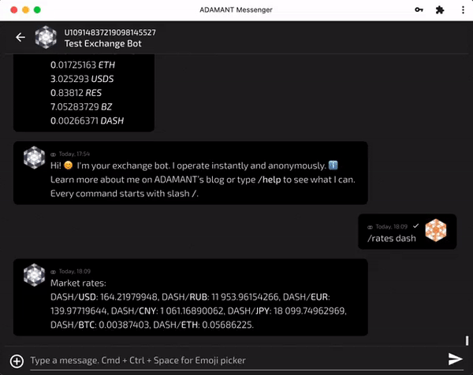

ADAMANT Exchange Bot is a software that allows you to launch own exchange, anonymous, instant and convenient. Exchange bots work in ADAMANT Messenger chats directly.

Coins supported:

- ADAMANT Messenger (ADM)
- Bitcoin (BTC)
- Ethereum (ETH)
- Lisk (LSK)
- Dash (DASH) with InstantSend
- Stably Dollar (USDS ERC20)
- Binance Coin (BNB ERC20)
- Dai (DAI ERC20)
- Tether (USDT ERC20)
- USD Coin (USDC ERC20)
- Onyxcoin (XCN ERC20)



Read more: [Multiple anonymous crypto exchanges on ADAMANT platform](https://medium.com/adamant-im/multiple-anonymous-crypto-exchanges-on-adamant-platform-11a607be0a9b).

# Installation

## Requirements

- Ubuntu 18+ (other OS had not been tested)
- NodeJS 14+
- MongoDB ([installation instructions](https://docs.mongodb.com/manual/tutorial/install-mongodb-on-ubuntu/))

## Setup

```
su - adamant
git clone https://github.com/Adamant-im/adamant-exchangebot
cd ./adamant-exchangebot
npm i
```

## Pre-launch tuning

The bot will use `config.jsonc` || `config.json`, if available, or `config.default.jsonc` otherwise.

```
cp config.default.jsonc config.jsonc
nano config.jsonc
```

Parameters: see comments in config file.

## Launching

You can start the Exchange Bot with the `node app` command, but it is recommended to use the process manager for this purpose.

```
pm2 start --name exchangebot app.js
```

## Add Exchange Bot to cron

```
crontab -e
```

Add string:

```
@reboot cd /home/adamant/adamant-exchangebot && pm2 start --name exchangebot app.js
```

## Updating

```
su - adamant
cd ./adamant-exchangebot
pm2 stop exchangebot
npm i
```

Update `config.jsonc` if `config.default.jsonc` changed.

Then `pm2 restart exchangebot`.
