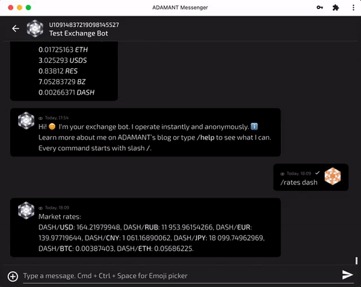

# ADAMANT Exchange Bot

ADAMANT Exchange Bot is self-hosted software that runs an anonymous, instant crypto exchange inside [ADAMANT Messenger](https://adamant.im) chats. A user sends the bot a coin in chat and names what they want back; the bot quotes a rate, validates the transfer on its own blockchain, and pays out.

You run it on your own server, and it custodies your own hot wallets. No third party holds the funds, there is no web interface to attack, and there is no account to register.



Read more: [Multiple anonymous crypto exchanges on the ADAMANT platform](https://medium.com/adamant-im/multiple-anonymous-crypto-exchanges-on-adamant-platform-11a607be0a9b).

## Features

- Runs entirely inside ADAMANT Messenger chats — no web UI, no accounts, no KYC surface
- Instant quotes at live market rates from ADAMANT InfoService
- Configurable service fee, per-coin fee overrides, and fixed buy and sell prices
- Per-user daily volume limits, a minimum exchange value, and max-buy / min-sell price guards
- Deep validation of every incoming transfer: sender, recipient, amount and timestamp are checked against the source blockchain and against the address the user published in the ADAMANT KVS
- Per-coin confirmation thresholds, with Dash InstantSend support
- Automatic refunds when an exchange cannot be completed
- Operator notifications over ADAMANT Messenger and Slack
- MongoDB-backed state, so in-flight exchanges survive a restart

## Supported coins

| Coin              | Ticker | Notes                                            |
| ----------------- | ------ | ------------------------------------------------ |
| ADAMANT Messenger | ADM    | Payout and message are a single in-chat transfer |
| Bitcoin           | BTC    | Esplora-compatible node                          |
| Ethereum          | ETH    |                                                  |
| Dash              | DASH   | InstantSend supported                            |
| Dogecoin          | DOGE   | Insight-compatible node                          |
| Tether            | USDT   | ERC-20                                           |
| USD Coin          | USDC   | ERC-20                                           |
| Dai               | DAI    | ERC-20                                           |
| ERC-20 tokens     | -      | ERC-20                                           |

## How it works

Each stage is a separate module, so a log line tells you exactly where an exchange is.

1. `incomingTxsParser` classifies every incoming ADAMANT message as a command, an exchange request, an answer to a clarification, or small talk
2. `depositWatcher` records new transfers to the bot when they first appear in each external mempool; an incomplete startup snapshot is never trusted for automatic settlement
3. `exchangeTxs` runs the basic checks, creates a chain-scoped deposit claim and calculates the quote
4. `deepExchangeValidator` verifies the on-chain sender, recipient, asset, amount and timestamp, then checks that the sender's KVS address predates the saved first-seen height
5. `confirmationsCounter` waits for `min_confirmations`, or for an InstantSend lock
6. `exchangePayer` and `sendBack` atomically reserve the canonical deposit before moving funds; competing eligible claims or missing first-seen evidence require operator review
7. `sentTxChecker` confirms the outgoing transfer and closes the deal

## Requirements

- Ubuntu 20.04 or newer — other operating systems have not been tested
- Node.js 22.13 or newer
- npm 10 or newer
- [MongoDB](https://www.mongodb.com/docs/manual/administration/install-community/) 4.4 or newer
- Funded hot wallets for every coin in `exchange_crypto`, plus ETH to pay the gas for ERC-20 payouts

## Installation

```sh
su - adamant
git clone https://github.com/Adamant-im/adamant-exchangebot
cd ./adamant-exchangebot
npm ci
```

## Configuration

The bot reads `config.jsonc` when it exists, and falls back to the shipped `config.default.jsonc`. Start by copying the shipped file:

```sh
cp config.default.jsonc config.jsonc
nano config.jsonc
```

Every parameter is documented in the file itself. These are the ones to set before the first launch:

| Parameter                                        | What it does                                                                        |
| ------------------------------------------------ | ----------------------------------------------------------------------------------- |
| `passPhrase`                                     | The bot's ADAMANT passphrase. **Every wallet the bot controls is derived from it.** |
| `node_ADM`                                       | ADAMANT nodes. The bot health-checks them and fails over automatically.             |
| `node_BTC`, `node_ETH`, `node_DASH`, `node_DOGE` | Nodes for the external coins you enable. Listing several gives you failover.        |
| `infoservice`                                    | ADAMANT InfoServices, used for exchange rates                                       |
| `db_url`, `db_name`                              | MongoDB connection string and database name                                         |
| `known_crypto`                                   | Every coin the bot has an adapter for                                               |
| `accepted_crypto`                                | Coins the bot takes in                                                              |
| `exchange_crypto`                                | Coins the bot pays out in                                                           |
| `erc20`                                          | Which known coins are ERC-20 tokens                                                 |
| `reserved_deposit_senders`                       | External sender addresses reserved for operator wallet top-ups                      |
| `exchange_fee`                                   | Service fee, as a percentage                                                        |
| `min_value_usd`                                  | Minimum accepted payment, as a USD equivalent                                       |
| `daily_limit_usd`                                | Daily exchange limit per user                                                       |
| `min_confirmations`                              | Confirmations required before a payout                                              |
| `bot_name`                                       | Name the bot uses in notifications                                                  |
| `adamant_notify`                                 | ADAMANT address that receives operator notifications                                |
| `slack`                                          | Slack incoming-webhook URL for operator notifications                               |
| `log_level`                                      | `none`, `error`, `warn`, `info`, `log`, `debug` or `trace`                          |

### Per-coin overrides

Any ticker from `known_crypto` can be appended to these parameters, for example `exchange_fee_ADM` or `min_confirmations_BTC`. An override that is unset — or set to `false` — inherits the general value.

| Parameter                     | Meaning                                                           |
| ----------------------------- | ----------------------------------------------------------------- |
| `exchange_fee_<COIN>`         | Service fee when the bot receives this coin                       |
| `min_confirmations_<COIN>`    | Confirmations required for this coin                              |
| `daily_limit_usd_<COIN>`      | Daily limit for buying this coin; `0` means no limit              |
| `max_buy_price_usd_<COIN>`    | Refuse to buy this coin above this price; `0` disables the guard  |
| `min_sell_price_usd_<COIN>`   | Refuse to sell this coin below this price; `0` disables the guard |
| `fixed_buy_price_usd_<COIN>`  | Buy this coin at a fixed price instead of the market rate         |
| `fixed_sell_price_usd_<COIN>` | Sell this coin at a fixed price instead of the market rate        |

The bot refuses to start on a config it cannot serve — a coin that is accepted but not known, or a coin with no node list, is reported and the process exits.

> `config.jsonc` holds the passphrase that controls every hot wallet. It is gitignored; keep it that way, and never paste it into an issue or a chat.

## Running

```sh
npm start          # node app.js
npm run start:dev  # reads config.test.jsonc
npm run clear      # drops the bot's collections — destructive, see below
```

`npm run clear` empties the `systems`, `incomingtxs`, `payments`, `deposits` and `depositclaims` collections. The bot then forgets every in-flight exchange, so stop it manually afterwards and only do this on a bot with nothing in flight.

### With pm2

A process manager is recommended so the bot restarts after a crash or a reboot.

```sh
pm2 start --name exchangebot app.js
pm2 logs exchangebot
pm2 restart exchangebot
pm2 stop exchangebot
```

### Starting on boot

```sh
crontab -e
```

Add the line:

```sh
@reboot cd /home/adamant/adamant-exchangebot && pm2 start --name exchangebot app.js
```

`pm2 startup` together with `pm2 save` does the same thing through systemd.

## Commands

Users talk to the bot in an ADAMANT Messenger chat.

| Command                           | Description                               | Example                 |
| --------------------------------- | ----------------------------------------- | ----------------------- |
| `/help`                           | Status, fees, limits and the command list | `/help`                 |
| `/rates <COIN>`                   | Market rates for a coin                   | `/rates ADM`            |
| `/calc <amount> <COIN> in <COIN>` | Convert at market rates                   | `/calc 2.05 BTC in USD` |
| `/test <amount> <COIN> to <COIN>` | Dry-run an exchange and see the estimate  | `/test 0.35 ETH to ADM` |
| `/balances`                       | The bot's current balances                | `/balances`             |
| `/version`                        | The running software version              | `/version`              |

**To make an exchange**, send the bot a transfer in chat with the ticker you want in the comment — for example, send 10 ADM with the comment `BTC`. If the comment does not name a coin, the bot asks which one you want.

`help` and `/balance` are accepted as well and corrected automatically.

## Updating

```sh
su - adamant
cd ./adamant-exchangebot
pm2 stop exchangebot
git pull
npm ci
```

Reconcile `config.jsonc` against `config.default.jsonc` if the shipped config changed, then:

```sh
pm2 restart exchangebot
```

## Security notes

- The bot holds hot-wallet keys derived from a single ADAMANT passphrase. Treat the server as a hot wallet, not a vault, and keep balances in proportion to your daily volume.
- Keep `config.jsonc` out of version control and off shared machines. The `logs/` directory contains addresses, amounts and transaction hashes.
- Set `adamant_notify` so failures reach a human. A bot that cannot pay out or refund unattended will strand funds until someone looks.
- The bot needs no inbound port. Run it behind a firewall.
- If the bot is interrupted while broadcasting a payout, it will not re-send that payout automatically on the next start — it flags the payment and notifies you, because a blind retry could pay a user twice. Check the coin's blockchain before acting.
- On upgrade, existing external payments without reliable mempool first-seen evidence and duplicate canonical deposit keys are quarantined for operator reconciliation before automatic settlement resumes
- The pending-transaction APIs of every enabled external node must be available. A watcher outage fails closed: affected deposits are sent to manual review instead of being paid from block timestamps alone
- Report a vulnerability privately to <devs@adamant.im> rather than in a public issue.

## Development

```sh
npm ci
npm run lint
npm run format:check
npm test
```

The test suite is unit-level: it makes no network requests, needs no MongoDB, and never reads your own config. See [CONTRIBUTING.md](./CONTRIBUTING.md) for the test layout and the review rules for changes that touch funds.

## Links

- [ADAMANT website](https://adamant.im)
- [ADAMANT Messenger web app](https://msg.adamant.im)
- [ADAMANT documentation](https://docs.adamant.im)
- [ADAMANT Improvement Proposals](https://aips.adamant.im) — [AIPs repository](https://github.com/Adamant-im/AIPs)
- [ADAMANT Node](https://github.com/Adamant-im/adamant) — the blockchain node this bot talks to
- [ADAMANT JavaScript API](https://github.com/Adamant-im/adamant-api-jsclient) — [documentation](https://js.docs.adamant.im)
- [ADAMANT wallet metadata](https://github.com/Adamant-im/adamant-wallets)
- [ADAMANT blockchain explorer](https://explorer.adamant.im)
- [ADAMANT blog](https://medium.com/adamant-im)
- [Issues and feature requests](https://github.com/Adamant-im/adamant-exchangebot/issues)

## License

[GPL-3.0](https://www.gnu.org/licenses/gpl-3.0.en.html)
